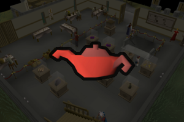

# Artefact Cleaner

This script will clean and use [lamps]([Ko-fi](https://ko-fi.com/fruart)) for slow XP. You can use it to train skills like defense, slayer, and prayer on pures. You can also use it to train for minigame access, such as farming for Tithe Farm.

If you like the script, consider donating to me on [Ko-fi](https://ko-fi.com/fruart) ☕. I'll be looking into updates and other scripts in the future.

See below for release notes!

## Requirements
- Reach level 10 in the desired skill
- Complete [The Dig Site](https://oldschool.runescape.wiki/w/The_Dig_Site) quest

## Start
- Download and install the JAR from [here](https://github.com/fru-art/fru-scripts/blob/master/out/artifacts/ArtefactCleanerScript.jar).  See [Community Script Guidelines](https://discord.com/channels/736938454478356570/1364978724105355324)
- Read the [Community Script Guidelines](https://discord.com/channels/736938454478356570/1364978724105355324)
- Obtain and equip the [cleaning tools](https://oldschool.runescape.wiki/w/Tools_(Varrock_Museum))
- Start the script with your character in the specimen cleaning area
  - Recommended to have a world hopping profile.  See [Profile Management Guidelines](https://discord.com/channels/736938454478356570/1393939764092207134/1393939764092207134)
  - Optional to use Humanised AFKs

## FAQ
> Why not spam-click to get rocks faster?

After significant testing, I've decided to remove spam-clicks from most of my scripts due to increased risks of bans.

> Can you add XYZ skill?

You can DM me to ask. I would appreciate a coffee on [Ko-fi](https://ko-fi.com/fruart) :)

## Release notes
- 1.0 (November 27, 2025) - Initial release

## Credits

Thanks to _@Nin ja_ (nin_ja.1) for originally sponsoring the script and extensively helping with testing.