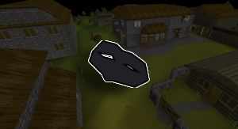

# Beginner Pickpocketer
for low-level thieving XP in Edgeville and Al Kharid.

If you like the script, consider donating to me on [Ko-fi](https://ko-fi.com/fruart) ☕. I'll be looking into updates and other scripts in the future.

## Start
- Setup required settings
    - Turn off _Highlight entities on tap_
    - Set NPC highlight _Highlighting colour_ and *Text colour* should be set to the default, _#05f8f8_
- Setup optional (but recommended) settings
  - Turn on _Disable examine_
  - Set _NPC Attack options_ to _Hidden_ or _Always long-tap_ or you may accidentally attack the NPC
    - Alternatively, turn _Auto-retaliate_ on
  - Set your camera zoom to between the first two breakpoints
    - `< • ▣ •   •   •   • >`
- Setup bank
  - If using food:
    - Only [one-bite popular food](https://oldschool.runescape.wiki/w/Food#Popular_foods) is supported
    - All food must be visible at the top of your main tab i.e. infinity symbol tab
- Tag all NPCs that you are pickpocketing and untag other nearby NPCs
  - You can do this using the yellow gnome button in the _Hotkeys_ menu
  - You should see the cyan highlight along with the cyan label above the NPCs' heads
- Download and install the JAR from [here](https://github.com/fru-art/fru-scripts/blob/master/out/artifacts/BeginnerPickpocketerScript.jar).  See [Community Script Guidelines](https://discord.com/channels/736938454478356570/1364978724105355324)
- Go to the appropriate region and start the script

## FAQ
> My health is really low, am I about to die?

The script should eat when your health is too low to take a single hit, if you have that setting on.

> Why don't Al Kharid warriors work? When will they work?

Much of the Al Kharid region is bugged in OSMB right now. I'm waiting on fix in the OSMB client first. No ETA.

> What are these messages about failsafes?

If you encounter an error about failsafes, ping me in the [help channel](https://discordapp.com/channels/736938454478356570/1415051321425526784).

This script is very click-intensive, so I added some extra measures to prevent the script getting stuck trying to perform an incorrect action repeatedly to avoid bans.

> Will you ever add other NPCs?

Thieving isn't one of my priorities right now, but I guess this script would be easily extended to support other NPCs. I'm not at that point in the game though. Maybe in a paid version in the future.

Davyy currently has a private elf script if you are looking for that.

# Release notes
- 0.12 (September 16, 2025) - Fix regions and save preferences
- 0.11 (September 16, 2025) - Fix auto-update issue
- 0.10 (September 15, 2025) - Avoid clicking on Wilderness border and add Varrock guards
- 0.9 (September 14, 2025) - Initial release