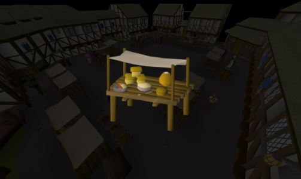

# Beginner Stall Thiever
for stealing from basic stalls and dropping items

If you like the script, consider donating to me on [Ko-fi](https://ko-fi.com/fruart) ☕. I'll be looking into updates and other scripts in the future.

## Start
- Required setup
    - Create a world hop profile
- Optional setup (but recommended)
    - Turn on _Disable examine_
    - Set _NPC Attack options_ to _Hidden_ or _Always long-tap_
- Download and install the JAR from [here](https://github.com/fru-art/fru-scripts/blob/master/out/artifacts/BeginnerStallThieverScript.jar)
  - See [Community Script Guidelines](https://discord.com/channels/736938454478356570/1364978724105355324)
- Go to the appropriate location and start the script

## FAQ
> XP rates?

Depends on hops, but baker's stall is upwards of 15k per hour and fruit stall is upwards of 30k per hour.

# Release notes
- 1.0 (October 31, 2025) - Initial release