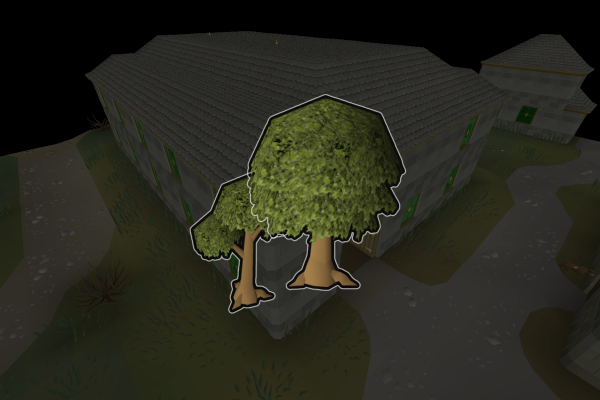

# Beginner Woodcutter

Cuts and banks logs from normal trees and oak trees near the west Varrock bank. Use the logs for firemaking, planks, or whatever!

If you like the script, consider donating to me on [Ko-fi](https://ko-fi.com/fruart) ☕. I'll be looking into updates and other scripts in the future.

See below for release notes!

## Start
- Download and install the JAR from [here](https://github.com/fru-art/fru-scripts/blob/master/out/artifacts/BeginnerWoodcutterScript.jar).  See [Community Script Guidelines](https://discord.com/channels/736938454478356570/1364978724105355324)
- Go to the Varrock near the west bank
- Make sure you have an axe in your inventory or equipped
- Start the script
    - Recommended to have a world hopping profile.  See [Profile Management Guidelines](https://discord.com/channels/736938454478356570/1393939764092207134/1393939764092207134)
    - Recommended to select both trees even if you desire oak logs; Oak trees will be prioritized

## Release notes
- 1.1 (August 27, 2025) - Improve banking
- 1.0 (August 26, 2025) - Initial release