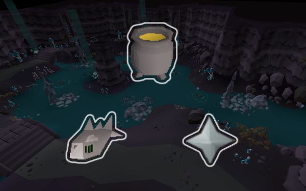

# Camdozaal Fisher

This script fishes, prepares, and offers fish in the [_Camdozaal Ruins_](https://oldschool.runescape.wiki/w/Ruins_of_Camdozaal). You'll earn Fishing, Cooking, and Prayer XP + barronite shards and barronite handles!

It also works on F2P! And it's great for ironmen or prayer pures or whatever!

If you like the script, consider donating to me on [Ko-fi](https://ko-fi.com/fruart) ☕. I'll be looking into updates and other scripts in the future.

See below for release notes!

## Start
- Download and install JAR from [here](https://github.com/fru-art/fru-scripts/blob/master/out/artifacts/CamdozaalFisherScript.jar). See [Community Script Guidelines](https://discord.com/channels/736938454478356570/1364978724105355324)
- Make sure you have a fishing net and knife in your inventory
- Go to Camdozaal fishing area and run script
    - Recommend world hopping instead of breaks. See [Profile Management Guidelines](https://discord.com/channels/736938454478356570/1393939764092207134/1393939764092207134)

## Known issues
- Script may not work correctly if you are able to catch fish that you can't prepare i.e. mismatched Fishing and Cooking levels
    - Workaround: Level up both your Fishing and Cooking past 33 (46 on members' world) with other methods first

## FAQ
- *Why won't it fish?*
    - Make sure you have fishing indicators on i.e. the teal tile with the little fish icons above them. If you do, try playing around with zoom and not zooming out too far.
- *What are XP rates like?*
    - Honestly, not amazing. Probably around 2k-5k Prayer XP per hour depending on fishing levels. The upsides are that this is non-combat, requires no money, and trains three skills at once.
- *What are barronite shards and handles?*
    - They are used to make the [barronite mace](https://oldschool.runescape.wiki/w/Barronite_mace) which is one of the best F2P weapons. You can also high alch the handles for an upwards of ~20k gp per hour.

## Release notes
- 1.2 (August 11, 2025) - Banking support for barronite handles + migration to animation/inventory tracking instead of XP tracking
- 1.1 (August 9, 2025) - Fixed issue with script not fully filling inventory with fish
- 1.0 (August 4, 2025) - Initial release
