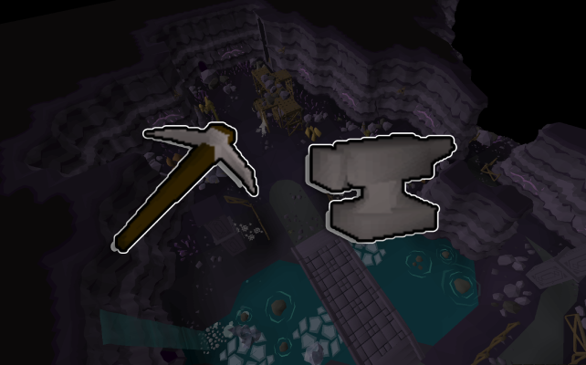

# Camdozaal Miner

This script mines barronite rocks and crushes deposits in the [_Camdozaal Ruins_](https://oldschool.runescape.wiki/w/Ruins_of_Camdozaal). You'll earn Mining and Smithing XP + [barronite shards](https://oldschool.runescape.wiki/w/Barronite_shards), [barronite heads](https://oldschool.runescape.wiki/w/Barronite_head), [Imcando hammers](https://oldschool.runescape.wiki/w/Imcando_hammer), gems, and [other loot](https://oldschool.runescape.wiki/w/Barronite_deposit)!

It also works on F2P!

If you like the script, consider donating to me on [Ko-fi](https://ko-fi.com/fruart) ☕. I'll be looking into updates and other scripts in the future.

See below for release notes!

## Start
- Download and install JAR from [here](https://github.com/fru-art/fru-scripts/blob/master/out/artifacts/CamdozaalMinerScript.jar). See [Community Script Guidelines](https://discord.com/channels/736938454478356570/1364978724105355324)
- Make sure you have a hammer and pickaxe with you
- Make sure you have both level 14 Mining and Smithing
- Set a world hopping profile since the script will use it to avoid crowded worlds. See [Profile Management Guidelines](https://discord.com/channels/736938454478356570/1393939764092207134/1393939764092207134)
- Go to the Camdozaal mining area and run script

## Known issues
- Script may get stuck trying to mine already mined rocks. This is an error that happens depending on the setup. If you see it, please screenshot and share.

## FAQ
> What are XP rates like?

I reached approximately level 40-50 Mining and Smithing in one day on a fresh account

## Release notes
- 1.5 (October 22, 2025) - API update
- 1.4 (August 27, 2025) - Fix banking and mining timeout
- 1.3 (August 26, 2025) - Improved walk and interact logic
- 1.2 (August 24, 2025) - Added auto-update
- 1.1 (August 21, 2025) - Migrated to updated OSMB distance methods
- 1.0 (August 14, 2025) - Initial release
