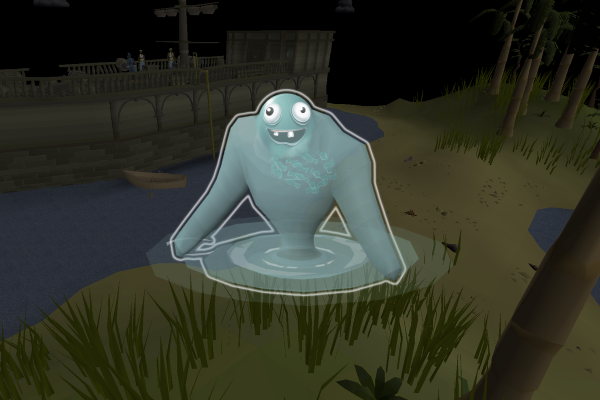

# Dumb Tempoross

This script completes the Tempoross minigame with help from other players on the dedicated Tempoross worlds.

There are many limitations to the behavior of this script, such as not being able to tend fires. You should expect only casual XP and permit rates. See _Known Limitations_ and _FAQ_ below for more details.

If you like the script, consider donating to me on [Ko-fi](https://ko-fi.com/fruart) ☕. I'll be looking into updates and other scripts in the future.

See below for release notes!

## Start
- Download and install the JAR from [here](https://github.com/fru-art/fru-scripts/blob/master/out/artifacts/DumbTemporossScript.jar).  See [Community Script Guidelines](https://discord.com/channels/736938454478356570/1364978724105355324)
- Highly recommended to switch to the most populated Tempoross world to receive help from other players. You will _NOT_ successfully complete the minigame without help
  - Therefore, recommended to use a break profile over a world hop profile. See [Profile Management Guidelines](https://discord.com/channels/736938454478356570/1393939764092207134/1393939764092207134)
  - As of September 4, 2025, the best world is _422 United States (west)_
- Set up your interfaces
  - Zoom the camera out all the way for the most consistent behavior
  - Set _Game_ messages to _Filtered_ in your chatbox
- Go to the Sea Spirit Dock
- Start the script

## Known issues
- Doesn't account for clouds or fires (but will replace lost equipment)
- Doesn't support gear such as better harpoons or Spirit angler outfit

## FAQ
> What are the permit rates?

You can expect 2000-4000 points in a 5-7 minute game, which should equate to about 25-35 permits per hour.

> What are XP rates?

Due to the lack of optimization, I would highly suggest using other fishing scripts to train fishing.

> Why is this script so dumb?

This was my first minigame script, and I didn't research efficient Tempoross gameplay until the script was already almost complete. This script basically mimics how I was playing Tempoross as a noob with additional limitations on top of that.

I figured I'd release it anyway because it's free, and people have been asking for a Tempoross script.

> Will there ever be updates? Or a separate better "smart" or solo Tempoross script?

I was considering creating an optimal solo Tempoross script, but I believe there is an official OSMB Tempoross script in the works. The official script may or may not be free, but this one will serve as a free alternative in perpetuity.

I may update this script to fix bugs or small issues, but don't expect large overhauls to the minigame behavior.

## Release notes
- 1.3 (September 6, 2025) - More chatbox scroll position fixes and better untethering logic
- 1.2 (September 6, 2025) - Fix chatbox scroll position becoming out of sync
- 1.1 (September 5, 2025) - Fix auto-update (needs manual re-download) and fix some tool retrieval paths 
- 1.0 (September 4, 2025) - Initial release