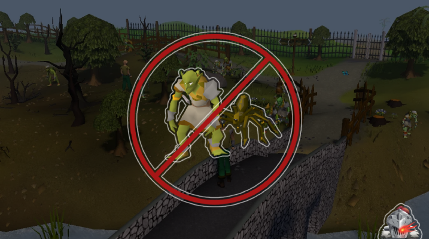

# Goblin Slayer

Are you a brand new adventurer? Help keep Lumbridge safe by killing Goblins (and spiders)! You can train your combat skills a little in the process.

If you like the script, consider donating to me on [Ko-fi](https://ko-fi.com/fruart) ☕. I'll be looking into updates and other scripts in the future.

See below for release notes!

## Start
- Download and install the JAR from [here](https://github.com/fru-art/fru-scripts/blob/master/out/artifacts/GoblinSlayerScript.jar).  See [Community Script Guidelines](https://discord.com/channels/736938454478356570/1364978724105355324)
- Go to the Lumbridge goblin area near the Al-Kharid gate
- Turn on auto-relatiate
- Start the script
    - Highly recommended to have a world hopping profile since the script will use it to avoid crowded worlds.  See [Profile Management Guidelines](https://discord.com/channels/736938454478356570/1393939764092207134/1393939764092207134)

## Known issues
- Script does not track ammo or runes

## Potential future updates
- Eat food
- Pick up items

## FAQ
- _Why am I not attacking?_
    - The script won't initiate a fight unless you have 8 HP or more. Just wait for regen, train some HP and Def, eat manually, etc.
- _What are XP rates?_
    - I got about 40 in all combat skills within a couple days.

## Release notes
- 1.1 (August 12, 2025) - Ignore goblins in the building. You don't wanna go in there. Trust me.
- 1.0 (August 12, 2025) - Initial release