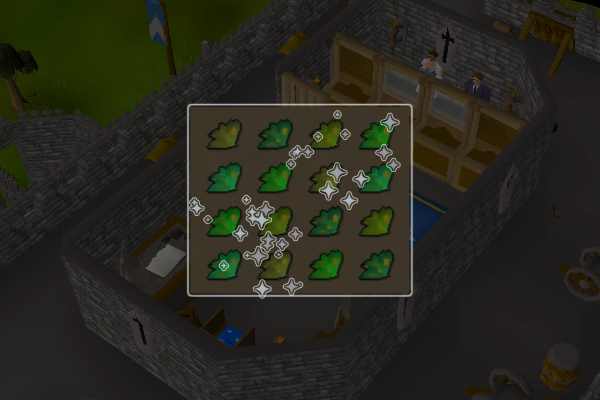

# Herb Cleaner

Bank-stands and fast-cleans all your dirty herbs with a bit of humanization.

If you like the script, consider donating to me on [Ko-fi](https://ko-fi.com/fruart) ☕. I'll be looking into updates and other scripts in the future.

See below for release notes!

## Start
- Download and install the JAR from [here](https://github.com/fru-art/fru-scripts/blob/master/out/artifacts/HerbCleanerScript.jar).  See [Community Script Guidelines](https://discord.com/channels/736938454478356570/1364978724105355324)
- Go to a bank (GE bankers not supported currently)
- Set up your bank and inventory
  - Dirty herbs that need cleaning should be near the top of your main tab i.e. the infinity symbol tab
  - Deposit unrelated items
- Start the script
    - Recommended to have a world hopping profile.  See [Profile Management Guidelines](https://discord.com/channels/736938454478356570/1393939764092207134/1393939764092207134)

## Known issues
- GE bankers not supported
- Degrime spell not supported

## FAQ
> What are XP rates?

You can expect to clean an upwards of 50,000 herbs in a reasonably human day. XP rates depend on the type of herb used.

> Is this good for money making?

I've found that you can make a bit of money with cheaper herbs that have high margins, but expensive herbs may not be profitable due to GE taxes.

See the [wiki calculator](https://oldschool.runescape.wiki/w/Calculator:Herblore/Herbs) and remember to account for GE taxes.

## Release notes
- 1.0 (September 4, 2025) - Initial release