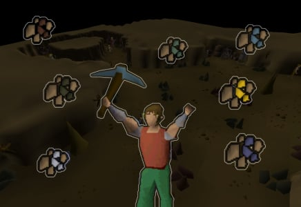

# Mining Guild

## Price: $50 lifetime fee
- Covers updates and support
- Can be used on any number of characters under your OSMB account
- If you want access before the OSMB web store is available, please DM me

### Mines and deposits ores up to adamant in the [member's area of the Mining Guild](https://oldschool.runescape.wiki/w/Mining_Guild#Members'_area)
- Great for collecting specific types of ores for [Giants' Foundry](https://oldschool.runescape.wiki/w/Giants'_Foundry)
- Great for gathering [unidentified minerals](https://oldschool.runescape.wiki/w/Unidentified_minerals) to get your [mining gloves](https://oldschool.runescape.wiki/w/Expert_mining_gloves) or [gems](https://oldschool.runescape.wiki/w/Bag_full_of_gems#Unidentified_minerals)
- Excellent for Mining XP in an area that is much less chatty than Motherlode Mine

### Bonus: Gold and silver mining in outer [Mor Ul Rek](https://oldschool.runescape.wiki/w/Mor_Ul_Rek)
- Great for Crafting XP when making jewelry
- Excellent for Smithing XP if using [Goldsmith gauntlets](https://oldschool.runescape.wiki/w/Goldsmith_gauntlets) at [Blast Furnace](https://oldschool.runescape.wiki/w/Blast_Furnace)

See below for release notes!

## Start
- Read the [Community Script Guidelines](https://discord.com/channels/736938454478356570/1364978724105355324)
    - Recommended to have a world hopping profile.  See [Profile Management Guidelines](https://discord.com/channels/736938454478356570/1393939764092207134/1393939764092207134)
- Get your gear
    - Get your pickaxe
    - Get your mining gloves if you have them
- Start the script with your character in the relevant area

## Known issues
- Does not currently support runite ore
- Does not currently support dropping ores

## FAQ
> Why does this cost $50?

A couple reasons:
- Because there is demand for a Mining training method that is safer than Motherlode Mine
- Because providing a popular free public version would crowd the available ore rocks

> What are XP rates?

- Mining iron ore: up to 50k Mining XP per hour
- Smithing gold bars at Blast Furnace with gauntlets: up to 300k Smithing XP per hour
- Crafting gold and silver jewelry: up to 50k Crafting XP per hour

> Can I use this to farm gold?

Mining iron is probably the most profitable, coming in at around 200-300k GP per hour. I don't plan on adding runite anytime soon because those rocks are always crowded by other bots.

## Release notes
- 1.0 (October 26, 2025) - Initial release